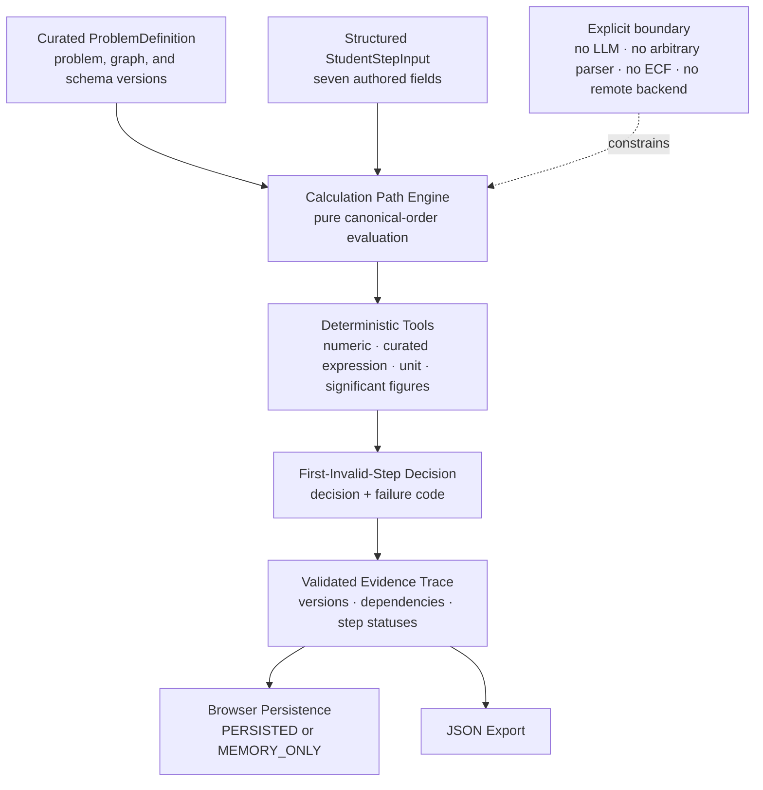

# Architecture

## Current data flow

## Implemented components

- The immutable fixture defines one `KP_FROM_EQUILIBRIUM_MOLES@1.0.0` problem and a seven-step `1.0.0` graph.
- The pure domain engine evaluates `orderedStepIds`, stops at the first invalid step, and records later inputs as `NOT_EVALUATED`.
- Four versioned deterministic tools check authored numeric, expression, unit, and significant-figure contracts.
- Runtime validation checks trace shape and internal agreement between step evaluations, decision, failure code, and first invalid step.
- The React workbench collects structured fields and presents evidence without owning evaluation rules.
- The archive uses one browser storage key and preserves an exportable current-tab trace when storage is unavailable.

## Deferred components

Natural-language parsing, arbitrary symbolic expressions, additional problem topologies, bounded ECF, hints, learner modelling, generated questions, model calls, and agent orchestration are not present. No service, database, vector store, gateway, or authentication layer is implied by this diagram.

## Trust boundary

The complete runtime is client-side. Problem and engine versions are compiled into the static bundle, but the browser, `localStorage`, timestamps, learner inputs, and downloaded JSON are user-controlled. Runtime validation detects malformed or internally inconsistent trace structures; it does not establish identity, prevent tampering, or provide cryptographic provenance. Any future production evidence claim would require a separately designed authenticated server-side boundary.
