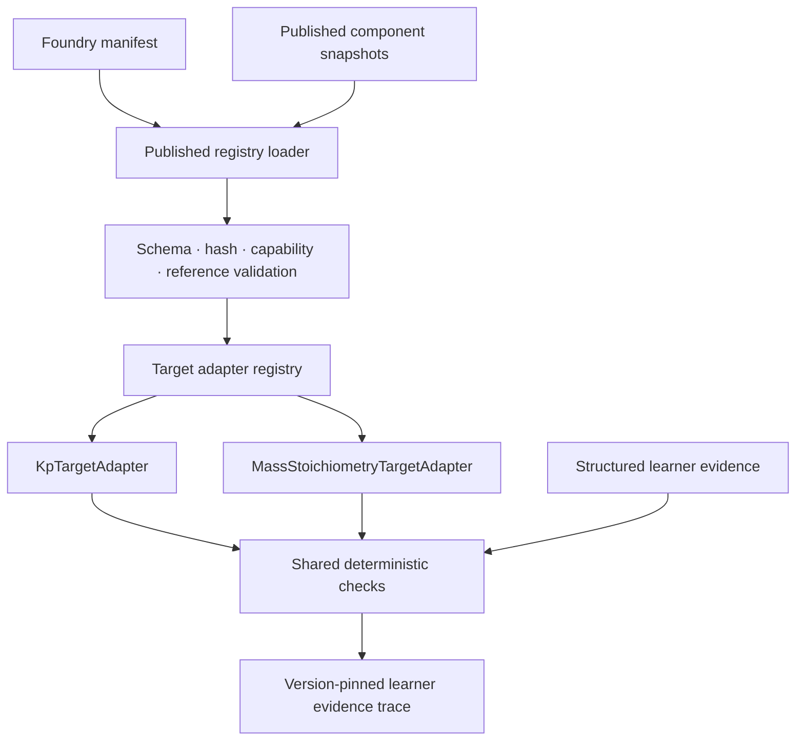

# Architecture

## Runtime boundary

Standard Trainer consumes immutable artifacts generated by Learning Foundry. It has no authoring or publication authority. The earlier V2 component boundary and developer inspector remain intact as a separately accessible diagnostic surface.

## Fail-closed sequence

1. Validate published shape and `PUBLISHED` status.
2. Recompute the stable content hash and compare it with snapshot and manifest.
3. Confirm schema version, target kind, expression nodes, diagnosis categories, and failure codes are supported.
4. Validate graph, formula, fact, strategy, and hint references.
5. Resolve the component by ID and optional version.
6. Select a registered target adapter.
7. Validate the attempt is pinned to that component version.
8. Run shared checks in pedagogical order and emit the first error.

## Preserved layers

- `src/domain` and `src/fixtures` retain V0.1 and V2 assets.
- The legacy V2 path uses a bounded structural support check rather than exact fixture serialization; its Kp semantics and 16-fixture regression remain unchanged.
- `src/component` retains the prior public manifest, preflight, invocation, and result envelopes.
- `src/ComponentInspector.tsx` remains a developer tool at `?view=inspector`.
- `src/foundry-runtime` is the new published-component consumer boundary.
- `src/published-components` is generated data and must not be edited manually.

## Trust boundary

All code runs in the browser. Registry validation detects malformed or mutated bundled artifacts, not supply-chain compromise or cryptographic identity. IDs, timestamps, and exported traces remain client-controlled. Production evidence would require authenticated server-side signing and storage outside this demo.

