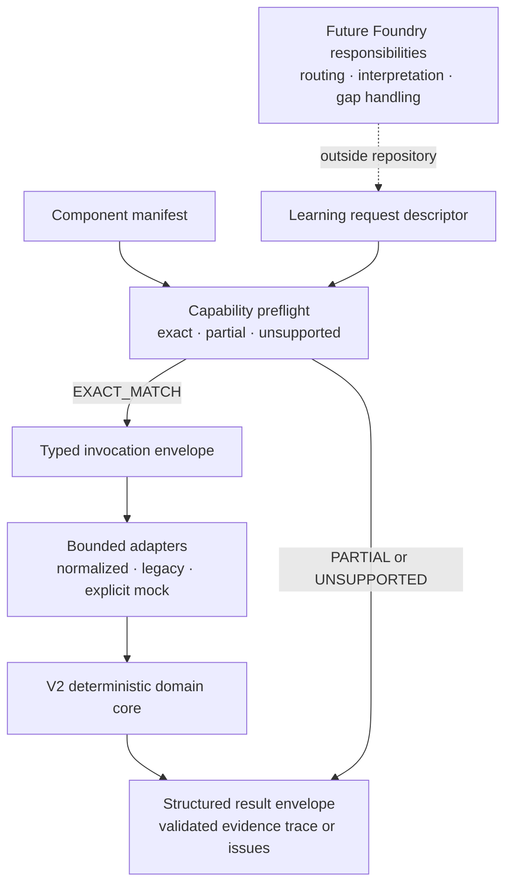

# Architecture

## Release boundary

The frozen V0.1 runtime and the `2.0.0-draft.2` V2 domain core remain intact. A thin public component boundary now exposes the V2 core to a future Learning Foundry caller without implementing that caller. Its manifest, capability preflight, invocation, and result contracts are documented in [V2 Trainer Component Boundary](COMPONENT_BOUNDARY.md). Recomputable equation evidence, recognition gating, strategy requirements, diagnosis policy, ordered revisions, and assistance provenance remain owned by the [V2 Domain Core](V2_DOMAIN_CORE.md) and [V2 Measurement Contract](V2_MEASUREMENT_CONTRACT.md).

## Current component flow

## Implemented components

- The immutable fixture defines one `KP_FROM_EQUILIBRIUM_MOLES@1.0.0` problem and a seven-step `1.0.0` graph.
- The pure domain engine evaluates `orderedStepIds`, stops at the first invalid step, and records later inputs as `NOT_EVALUATED`.
- Four versioned deterministic tools check authored numeric, expression, unit, and significant-figure contracts.
- Runtime validation checks trace shape and internal agreement between step evaluations, decision, failure code, and first invalid step.
- The React workbench collects structured fields and presents evidence without owning evaluation rules.
- The archive uses one browser storage key and preserves an exportable current-tab trace when storage is unavailable.
- The V2 public API shape-validates unknown problems/attempts, compares complete canonical problem content with the one supported gold authority, applies recognition gating, aligns independent versus solution evidence, semantically validates embedded and explicit equations before arithmetic, runs versioned deterministic checks, selects the first pedagogical error, derives causally linked support outcomes, and validates the emitted trace.
- Revision sequence and revision `stepIds` are the sole temporal authority; `attempt.steps` array order and display symbols do not control diagnosis.
- Base deterministic outcomes remain separate from learner-facing hint-support overlays, so a supported stage can retain a tool `PASS`; the overlay and support outcome share one resolved decision revision.
- A limited V1 structured adapter records the existing seven-field form as full-scaffold provenance without modifying the V0.1 runtime.
- A four-scenario typed-working mock adapter provides deterministic normalized inputs for future UI work; it is not a parser.
- A public component manifest declares the single supported problem, supported input envelopes, deterministic outputs, and explicit limitations.
- Capability preflight distinguishes exact, partial, and unsupported requests without invoking the domain engine or pretending missing interpretation exists.
- The invocation boundary enforces request/input agreement and fixes adapter provenance before it calls the existing V2 public API.
- The structured result envelope preserves validated diagnosis traces and returns fail-closed issues for invalid or unsupported inputs.
- The default React surface is a minimal developer inspector. The frozen V0.1 workbench remains reachable with `?view=legacy`.

## Deferred components

Natural-language parsing, OCR, arbitrary symbolic expressions, additional problem topologies, bounded ECF, hint delivery, learner modelling, generated questions, model calls, and agent orchestration are not present. A Learning Foundry registry, chat shell, temporary support generator, capability-gap store, library, and schedule are also deferred. No service, server endpoint, database, vector store, gateway, or authentication layer is implied by this diagram.

## Trust boundary

The complete V0.1 runtime is client-side. Problem and engine versions are compiled into the static bundle, but the browser, `localStorage`, timestamps, learner inputs, and downloaded JSON are user-controlled. The V2 domain does not create timestamps or IDs; its caller supplies them explicitly and validators require valid ISO timestamps. Runtime validation detects malformed or internally inconsistent structures; it does not establish identity, prevent tampering, or provide cryptographic provenance. Any future production evidence claim would require a separately designed authenticated server-side boundary.
