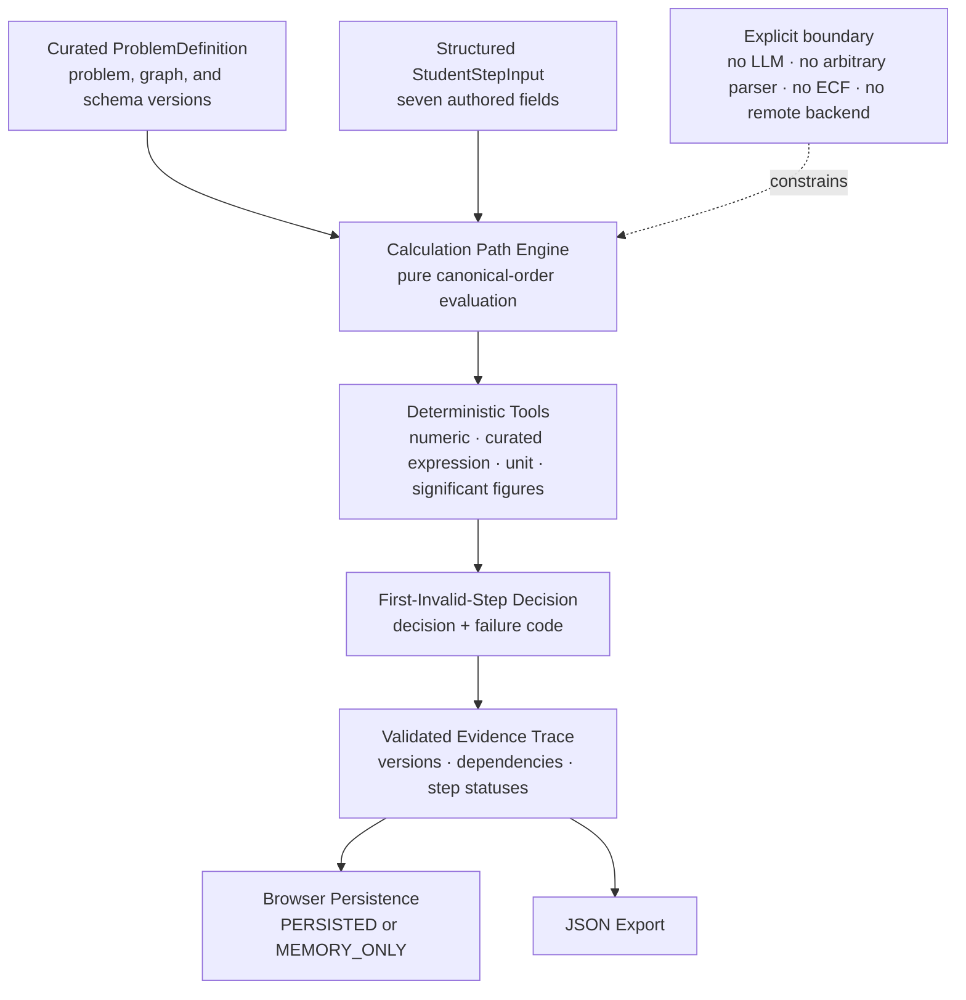

# Architecture

## Release boundary

The diagram below remains the frozen V0.1 live runtime. The separate `2.0.0-draft.2` V2 domain core now executes the modality-neutral contract without changing the learner UI. Its runtime boundary, recomputable equation evidence, recognition gate, strategy requirements, diagnosis policy, ordered revisions, and assistance provenance are described in [V2 Domain Core](V2_DOMAIN_CORE.md) and specified in [V2 Measurement Contract](V2_MEASUREMENT_CONTRACT.md).

## Current data flow

## Implemented components

- The immutable fixture defines one `KP_FROM_EQUILIBRIUM_MOLES@1.0.0` problem and a seven-step `1.0.0` graph.
- The pure domain engine evaluates `orderedStepIds`, stops at the first invalid step, and records later inputs as `NOT_EVALUATED`.
- Four versioned deterministic tools check authored numeric, expression, unit, and significant-figure contracts.
- Runtime validation checks trace shape and internal agreement between step evaluations, decision, failure code, and first invalid step.
- The React workbench collects structured fields and presents evidence without owning evaluation rules.
- The archive uses one browser storage key and preserves an exportable current-tab trace when storage is unavailable.
- The V2 public API validates unknown problems/attempts, applies recognition gating, aligns normalized evidence, evaluates structured ASTs, runs versioned deterministic checks, selects the first pedagogical error, derives causally linked support outcomes, and validates the emitted trace.
- A limited V1 structured adapter records the existing seven-field form as full-scaffold provenance without modifying the V0.1 runtime.
- A four-scenario typed-working mock adapter provides deterministic normalized inputs for future UI work; it is not a parser.

## Deferred components

Natural-language parsing, OCR, arbitrary symbolic expressions, additional problem topologies, bounded ECF, hint delivery, learner modelling, generated questions, model calls, and agent orchestration are not present. No service, server endpoint, database, vector store, gateway, or authentication layer is implied by this diagram. The public live UI remains V0.1.

## Trust boundary

The complete V0.1 runtime is client-side. Problem and engine versions are compiled into the static bundle, but the browser, `localStorage`, timestamps, learner inputs, and downloaded JSON are user-controlled. The V2 domain does not create timestamps or IDs; its caller supplies them explicitly. Runtime validation detects malformed or internally inconsistent structures; it does not establish identity, prevent tampering, or provide cryptographic provenance. Any future production evidence claim would require a separately designed authenticated server-side boundary.
